# AWS concepts

### Information from:

AWS Basics for Beginners - Full Course
https://www.youtube.com/watch?v=ulprqHHWlng&ab_channel=freeCodeCamp.org

## VPC

VPC is a logically isolated portion of AWS cloud within a region.
Different subnets can be created for different data centers.
Internet gateway is necessary to connect to the internet, because the EC2 instances are
launched within the subnets with and local ip address.
AWS creates a default VPC.
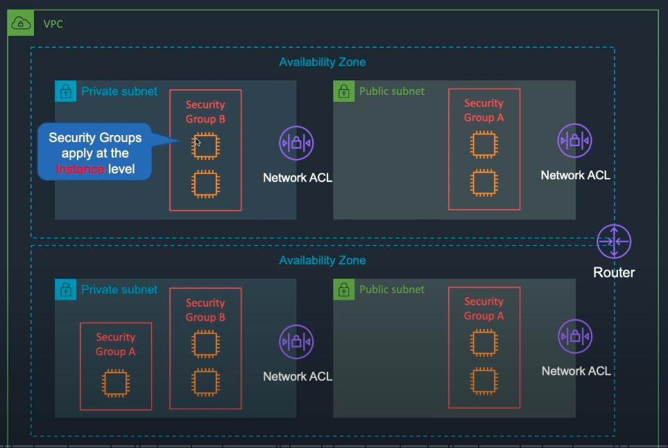

The subnets can also have custom ACL rules (access control lists):
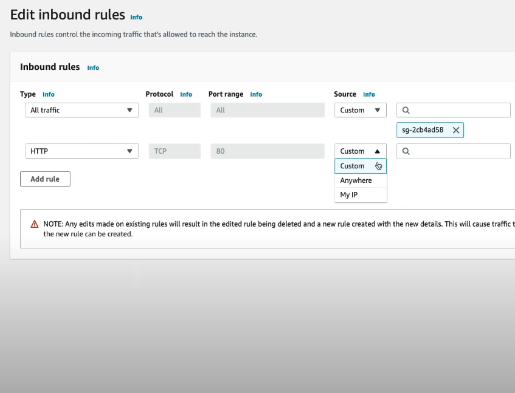

## Stateful vs stateless firewalls

Stateful allows the return traffic automatically without checking a inbound rule. On the other hand, stateless firewall check the rules for both connections.
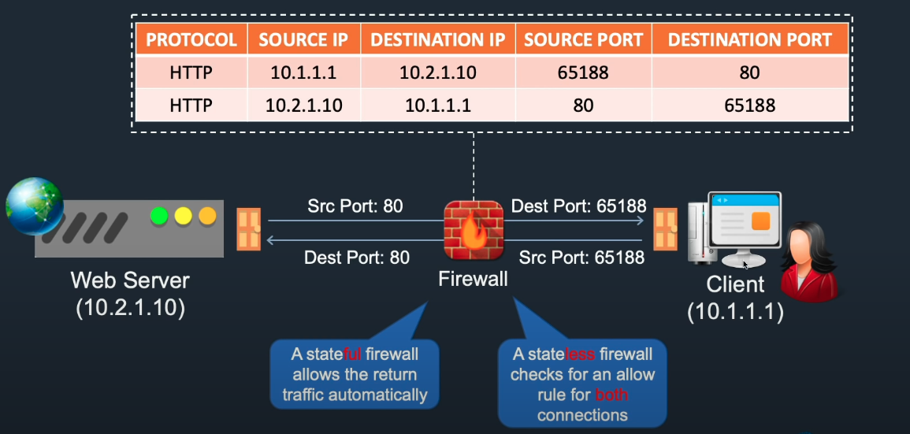
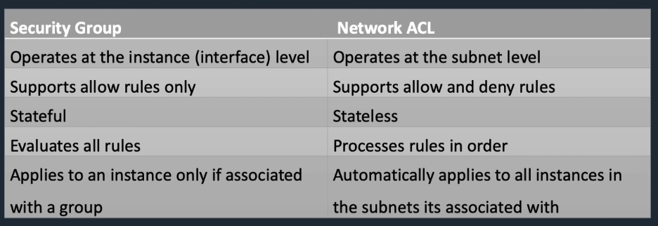

## AWS Public and Private services

For example, if your EC2 wants to connect to the Amazon S3 needs to go throught the internet gateway.

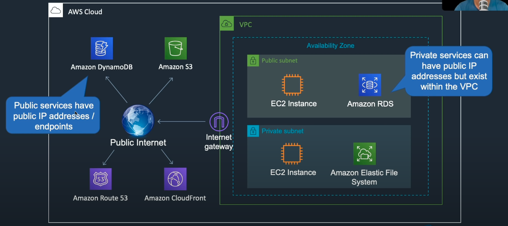

## Amazon elastic compute cloud (EC2)

EC2 instances are like virtual machine, it has a CPU, RAM, OS, drive space and a network interface.

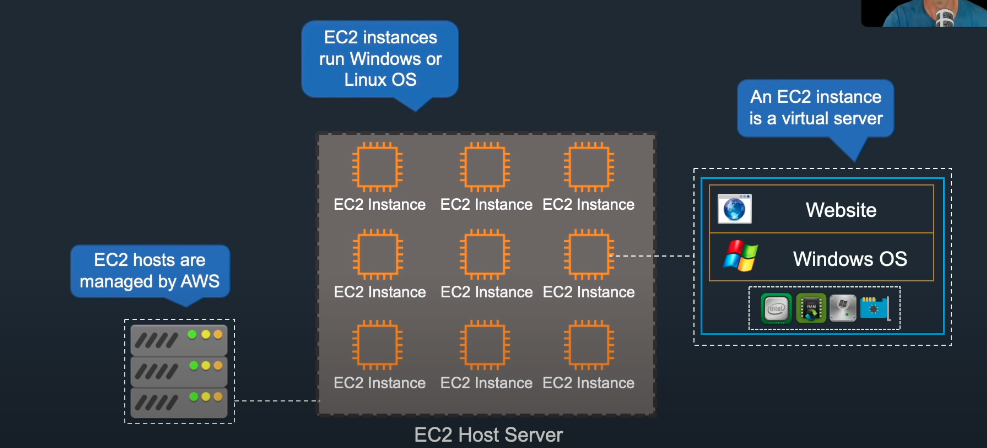

The instances can have a public, private or elastic IP address. The public IP changes every time that the instance stops, the private is used for internal use and it is retained when the instance stops, the elastic is a static public IP and it is associated to the private IP of the instance.

The NAT (network address translation) gateway receives the traffic from the private IP and fowards the connection to the internet gateway using a elastic IP.

Before lauching the EC2 instance we need to define the Amazon Machine Image(AMI), the Instance types (e.g. t2.micro)

1. choose an Amazon Machine Image (AMI):

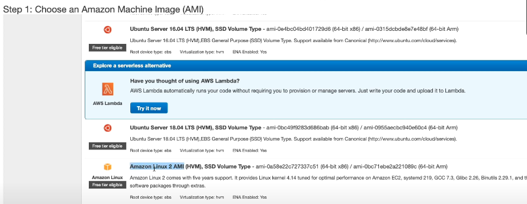

2. Choose the instance type:

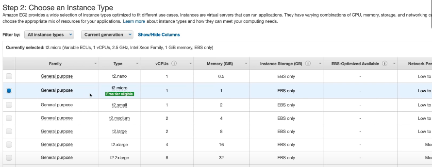

3. Instance details (for example I can add the instance in a specific subnet):

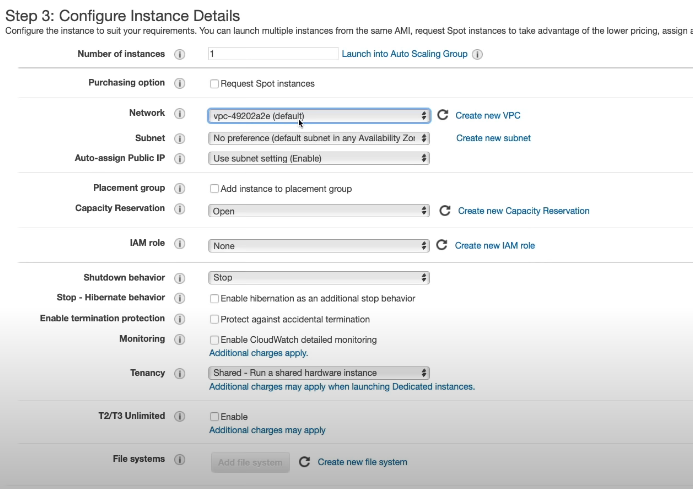

4. Add storage and volume type:

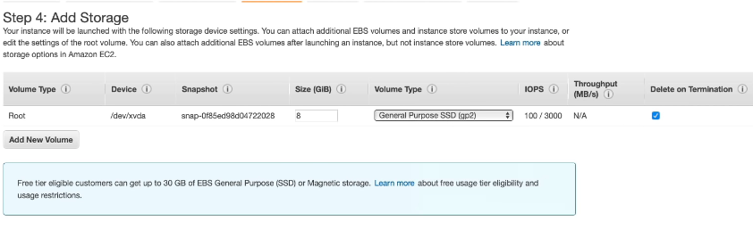

5. Create a security group: 
   The default group gives access to the PORT 22 with the SSH key.

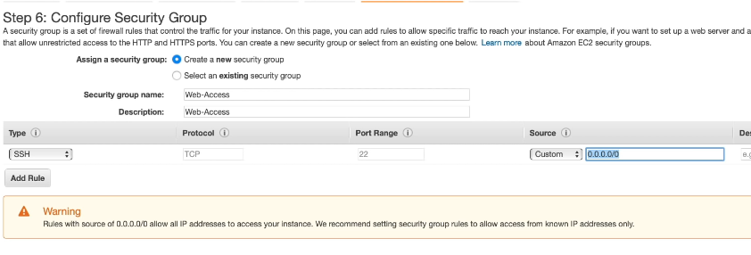

6. Create a key pair to access the instance:

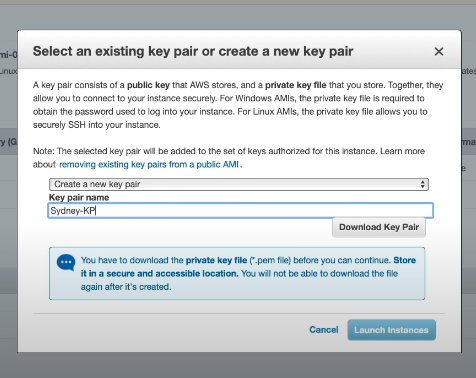

When I connect to my instance I need to change the permission of the KP (key pair):
chmod 400 keyPairName.pem

To connect to the instance using the public IP address:
ssh -i "keyPairName.pem" ec2-user@PublicIPAddress

To install the dependencies in the instance we run:

sudo yum update -y : yum is used to install or update packages on Linux
sudo yum install httpd -y: Install the Apache web server
sudo systemctl start httpd
sudo systemctl enable httpd
echo "This is a test to run an Apache EC2 instance" | sudo tee -a /var/www/html/index.html : tee -a appends content to a file when I cannot use the > command (I can also try chmod +w index.html)

to confirm if the content was added:
cat /var/www/html/index.html
curl "IPv4 address here"

I also need to allow the access to HTTP adding another rule to the security group:
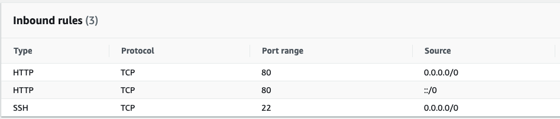
curl localhost:80

PS: To run in the browser I need to change HTTPS to HTTP

<!-- Using access keys with EC2 -->

## To install node in a EC2 instance:

https://docs.aws.amazon.com/sdk-for-javascript/v2/developer-guide/setting-up-node-on-ec2-instance.html
